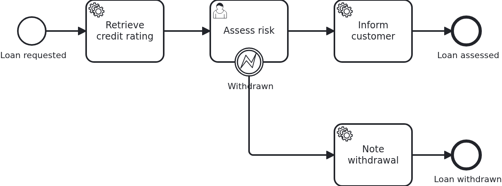

# User tasks

[](./LICENSE)

A user task is a process waiting for a person. The BPMS opens the task and then does
nothing at all until somebody answers, which may be minutes or weeks later. This blueprint
shows the two ends of that wait: what the application has to keep while the task is open,
and how it later completes or cancels it.

## What this blueprint shows



The loan approval of the base blueprint, with a risk assessment somebody has to do before
the customer is informed. Three things happen around that task:

- The task is created and VanillaBP calls `WorkflowTaskHandler#assessRisk` to say so. The
  method does not do the work, it receives the task's `@TaskId` and stores it on the
  workflow aggregate. Returning does not complete the task, and that is the difference to a
  service task.
- Somebody answers through the API, which calls `ProcessService#completeUserTask` with the
  stored id. The workflow leaves the user task and the service task behind it runs.
- Or the customer withdraws the request while the assessment is open. The application calls
  `cancelUserTask` with the error code `loan-withdrawn`, so the workflow leaves through the
  error boundary event instead.

The same handler method is called a second time when the task is canceled, this time with
`@TaskEvent CANCELED`, and it drops the stored id. A method without a `@TaskEvent`
parameter never learns about cancellations, which is worth knowing before keeping a task id
around: the workflow may take the task away for reasons the application never asked for, an
interrupting boundary event or the workflow ending.

Two smaller things this blueprint carries:

- The URLs continuing the process are logged when the task is created. That is the place
  where a real application notifies whoever has to act, by mail or by putting the task into
  a task list.
- A task id is a link somebody keeps, so it outlives the task it points at.
  `Service#openRiskAssessment` compares the id in the URL with the one on the aggregate and
  refuses anything else, which is how a link opened twice ends as a message rather than a
  call to the BPMS.

Canceling a user task is not supported by every BPMS: the engine has to offer a command for
it, and Camunda 8 does not up to and including version 8.8. VanillaBP answers such a call
with an error naming the reason instead of pretending, and the test covering the
cancellation runs on Camunda 7 for that reason. Which operations a BPMS supports is on
[its adapter's wiki page](https://github.com/vanillabp/adapter-platform-integration/wiki/BPMS-adapters).

## Delta to the base blueprint

Compared to [`module-single`](https://github.com/vanillabp-blueprints/module-single-springboot):

|            File            |                                                           What is different                                                            |
|----------------------------|----------------------------------------------------------------------------------------------------------------------------------------|
| `loan_approval.bpmn`       | a user task between the service task and the end, an error boundary event on it, and two service tasks showing where the workflow went |
| `WorkflowTaskHandler.java` | the `@WorkflowTask` method of the user task, taking `@TaskId` and `@TaskEvent`                                                         |
| `Workflow.java`            | `completeUserTask` and `cancelUserTask` in addition to `startWorkflow`                                                                 |
| `Service.java`             | the two halves of a user task: what happens when it opens, and what happens when the answer arrives through the API                    |
| `ApiController.java`       | the URLs answering and withdrawing, both carrying the task id                                                                          |
| `Aggregate.java`           | `riskAssessmentTaskId` and what the process wrote on the way out                                                                       |
| `LoanApprovalIT.java`      | one test per way a user task ends: answered, canceled, and still open                                                                  |
| `pom.xml`                  | hands the BPMS of the build to the tests, so the cancellation test knows where it can run                                              |

## Running it

Requires a JDK 21. Camunda 7 is embedded, so nothing else has to run:

```bash
mvn install verify
```

Running it on another BPMS is a Maven profile, not one line of Java changes:

```bash
mvn install verify -Pcamunda8
```

Camunda 8 is a remote engine, so a cluster has to run and be pointed at. Start one, then
add its address to `application/src/main/resources/application.yaml` and to
`loan-approval/src/test/resources/application.yaml`:

```yaml
vanillabp:
  adapters:
    camunda8:
      rest-address: http://localhost:8080
      # Nothing else is needed: this adapter keeps workflow modules apart by nothing at all
      # ('name-clash-avoidance: none') unless told otherwise, because a cluster started from
      # the stock image has multi-tenancy switched off and rejects a tenant per module. The
      # adapter warns about it while booting - with one workflow module the identifiers are
      # unique anyway. Set 'name-clash-avoidance: use-prefix' to have VanillaBP prefix them.
```

The test canceling the user task does not run there, and the build says so as a skipped
test rather than as a passing one.

Start the application:

```bash
mvn -pl application spring-boot:run
```

Booting logs a warning per workflow module: both Camunda adapters start out with
`name-clash-avoidance: none`, so nothing keeps the identifiers of one workflow module apart
from those of another, and the adapter asks for a decision instead of picking one. One module
cannot collide with itself, so this blueprint leaves it at that. Answering the question is one
property, `vanillabp.adapters.<id>.accept-unscoped-identifiers: true`, and the modes a BPMS
offers are in
[the wiki](https://github.com/vanillabp/adapter-platform-integration/wiki/Workflow-modules#how-name-clashes-are-avoided).

Start a loan approval. This is the only URL you need:

```
http://localhost:8080/api/loan-approval/start?amount=5000
```

The process runs up to the risk assessment and stops there. What it logs are the URLs
continuing it, each one filled in and ready to be clicked:

```
Loan approval '0f7c…' started
Credit rating of loan approval '0f7c…' is 50
Loan approval '0f7c…' waits for a risk assessment. Continue with one of:
  Acceptable    -> http://localhost:8080/api/loan-approval/0f7c…/assess-risk/1a2b…?riskIsAcceptable=true
  Too risky     -> http://localhost:8080/api/loan-approval/0f7c…/assess-risk/1a2b…?riskIsAcceptable=false
  Withdraw      -> http://localhost:8080/api/loan-approval/0f7c…/withdraw/1a2b…
```

Opening one of the first two completes the task, and the process continues to its end:

```
Risk of loan approval '0f7c…' was assessed as acceptable
The customer of loan approval '0f7c…' was informed that the risk is acceptable
```

Opening the third one cancels it instead, and the workflow takes the error path:

```
The risk assessment of loan approval '0f7c…' was canceled
Loan approval '0f7c…' was withdrawn by the customer
Loan approval '0f7c…' ended as withdrawn
```

The first of those three lines is the cancellation notification arriving at the same handler
method that was called when the task was created. Opening the same URL twice answers with the
message that this assessment is not open any more, which the application decides on its own,
without asking the BPMS.

While the application runs on Camunda 7, Camunda's own web applications are served at

```
http://localhost:8080/camunda
```

Log in with `demo` / `demo`. Cockpit shows what the engine is doing with the workflows
started above, which is the view the logged URLs cannot give: where an instance stands, and
why a job failed. The user comes from
`application/src/main/camunda7/resources/camunda7-webapps.yaml` and exists so that the
blueprint can be operated without setting one up; an application with an identity provider
of its own leaves that section out.

The Camunda 8 profile ships neither the dependency nor that file. Its tooling is part of
the cluster, and the file names a Camunda 7 adapter id, which VanillaBP would rightly
refuse to start with.

## How it works

|                                          File                                          |                                                         Role                                                         |
|----------------------------------------------------------------------------------------|----------------------------------------------------------------------------------------------------------------------|
| `loan-approval/src/main/resources/loan-approval/processes/camunda7/loan_approval.bpmn` | the process: a user task carrying the task definition, an error boundary event on it, and a service task per way out |
| `.../loanapproval/WorkflowTaskHandler.java`                                            | the `@WorkflowTask` method of the user task: `@TaskId`, `@TaskEvent`, and no work of its own                         |
| `.../loanapproval/Service.java`                                                        | both halves of the task: keeping the id when it opens, answering it when the API is called                           |
| `.../loanapproval/Workflow.java`                                                       | `completeUserTask` and `cancelUserTask`, the only place `ProcessService` is used                                     |
| `.../loanapproval/ApiController.java`                                                  | the GET endpoints answering and withdrawing                                                                          |
| `.../loanapproval/model/Aggregate.java`                                                | `riskAssessmentTaskId`, the handle to the open task, plus what the process wrote                                     |
| `loan-approval/src/test/.../LoanApprovalIT.java`                                       | one test per way the task ends, waiting for the aggregate rather than asking the engine                              |

The order of events: the service task fills in the credit rating, then the BPMS creates the
user task and calls `WorkflowTaskHandler#assessRisk` with `TaskEvent.CREATED`. The handler
hands over to `Service#riskAssessmentOpened`, which stores the task id on the aggregate -
VanillaBP saves the aggregate after the call, like for any other task. The workflow now
waits.

Whenever the answer arrives, `ApiController` calls `Service#assessRisk`, which writes the
result and tells `Workflow` that the risk was assessed. `Workflow#riskAssessed` calls
`ProcessService#completeUserTask` with the id, in a transaction: the aggregate is saved
along with the answer, and on a remote BPMS the completion is sent only after that
transaction committed. A rollback therefore leaves the task open instead of completing a
task whose result was undone.

Withdrawing takes the same route through `cancelUserTask`, with an error code the BPMN
catches. The task is gone afterwards, so the handler is called once more with
`TaskEvent.CANCELED` and drops the stored id. VanillaBP finds the BPMS holding the task by
itself, which is why neither `Workflow` nor `Service` names one.

The tests wait rather than assert immediately. A BPMS runs tasks in transactions of its own,
and a user task created by a remote engine arrives a moment after the workflow was started.
Asserting right away would pass on an embedded engine and fail on a remote one.

## Documentation

- [User tasks](https://github.com/vanillabp/adapter-platform-integration/wiki/Workflow-tasks#user-tasks): the notification handler, the task id and completing the task later
- [Parameters](https://github.com/vanillabp/adapter-platform-integration/wiki/Workflow-tasks#parameters): `@TaskId`, `@TaskEvent` and everything else a handler may ask for
- [Completing and canceling asynchronous tasks](https://github.com/vanillabp/adapter-platform-integration/wiki/Workflow-tasks#completing-and-canceling-asynchronous-tasks): the rules those calls follow, which are the ones a user task follows too
- [User tasks and asynchronous tasks](https://github.com/vanillabp/spi-for-java#user-tasks-and-asynchronous-tasks): the annotations used in `WorkflowTaskHandler.java`
- the wiki of the [BPMS adapter](https://github.com/vanillabp/adapter-platform-integration/wiki/BPMS-adapters) you use: which BPMN attribute carries the task definition of a user task, and whether cancellations are supported

This blueprint is developed in the monorepo
[`blueprints`](https://github.com/vanillabp-blueprints/blueprints). This repository is a
read-only mirror, **issues and pull requests belong there.**

## Noteworthy & Contributors

[VanillaBP](https://www.github.com/vanillabp/spi-for-java) was developed by [Phactum](https://www.phactum.at) with the
intention of giving back to the community as it has benefited the community in the past.


## License

Copyright 2026 Phactum Softwareentwicklung GmbH

Licensed under the Apache License, Version 2.0
